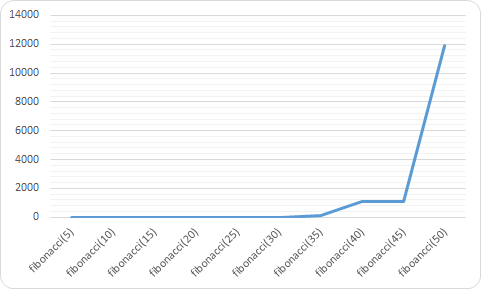
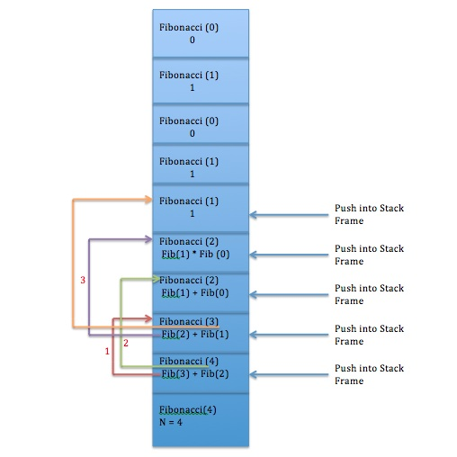

# n번째 Fibonacci 구하기!

n번 째 피보나치수를 구하는 방법을 알아보겠습니다. 

저는 구하는 방법으로 두 가지를 생각했습니다. 
하나는 재귀함수를 사용하는 방법이고 
다른 하나는 반복문을 사용하는 방법입니다. 

결론부터 말하자면 이 두가지 방법 중 반복문을 사용하여 피보나치 수열을 구현하는 것이 더 좋은방법입니다. 
지금부터 두 가지 방법을 사용하여 피보나치 수열을 구하는 방법과 왜 반복문을 사용하는 것이 더 효율적인 방법인지 알아보겠습니다. 


## 1. fibonacci란?
피보나치수는 무엇일까요? 피보나치수는 다음과 같이 정의되는 수열입니다. 


fibonacci수열은 0 1 1 2 3 5 8 13... 이며 앞에 있는 두 수를 더하여 그 다음의 수를 얻을 수 있습니다. 

첫 번째 수와 두 번째 수는 0과 1로 정해져있습니다.

그 다음 n번 째 fibonacci는 (n-1번 째 fibonacci)+(n-1번 째 fibonacci)입니다. 

## 2. 재귀함수로 피보나치수열 구현하기 

이 식을 재귀함수를 사용한 함수로 구현하면 다음과 같습니다. 

```javascript
function fibonacci(num){
  if(num == 1){
    return 0;
  }
  if(num == 2){
    return 1;
  }
  return fibonacci(num-1) + fibonacci(num-2)
}

```
위의 함수를 부르는 과정을 그림으로 표현하자면 다음과 같습니다. 

```
                         fib(5)   
                     /                  
               fib(4)                fib(3)   
             /                      /     
         fib(3)      fib(2)         fib(2)    fib(1)
        /                              
  fib(2)   fib(1)                
    
```
풀어서 설명하자면, 
fibonacci(5)는 fibonacci(4) + fibonacci(3) 이 됩니다. 
이 말은 fibonacci 함수 인자에 5를 넣으면 다시 인자가 4 인 fibonacci함수를 부른다는 것입니다.  
이것이 바로 **재귀함수**입니다. 

**재귀함수**란 자기 자신을 호출하는 함수입니다. 

다시 돌아가서  fibonacci(4)는 다시 fibonacci(3) + fibonacci(2)를 부릅니다.

다시 fibonacci(3)은 fibonacci(2) + fibonacci(1)를 부릅니다. 
여기서 fibonacci(2) 와 fibonacci(1)의 값은 1과 0으로 정하였으므로 더이상 함수를 부르지 않고 값이 계산되어 나오게 됩니다. 
그러므로 fibonacci(3)은 0+1인 1이 됩니다.

그 다음에 fibonacci(4)를 계산하려고 불렀던 fobonacci(2)를 계산하게 됩니다. 

그럼 fibonacci(4)는 계산이 완료 되고 다시 fibonacci(3)을 계산해야 합니다. 

이 과정을 거쳐야 다섯번째 피보나치 수인 fibonacci(5)를 구할 수 있습니다. 
 

만약  fibonacci(5)가 아닌 fibonacci(100), fibonacci(1000)이면 어떨까요? 


5번 째 피보나치를 구하기 위해서는 함수를 9번 호출하여 작동이 가능합니다. 거의 두 배에 가까운 숫자입니다.  
10 번 째 피보나치는 109번, 20 번 째 피보나치는 13529번, 30번 째 피보나치는 1664079번 함수를 불러야 합니다. 

실제로 실행해보면 fibonacci(45)부터 느리게 계산된 다는 것을 알 수 있습니다. 
fibonacci(100)은 아마 브라우저가 작동을 멈추게 되겠죠? 

다음은 피보나치 수열을 구하는 함수의 실행시간 그래프입니다. 
구하려는 피보나치 수가 커질수록 급격하게 그래프가 치솟는 것을 볼 수 있습니다. 



## 3. 함수 스택 

여기서 stack의 개념이 필요합니다.

함수를 호출하면 마치 박스에 책을 넣는 것 처럼 쌓이게 됩니다.
박스에 넣은 책을 꺼내기 위해서는 위에서부터 빼내야 합니다.
또한 동시에 뺄 수 없기 때문에 순서대로 뻬야 합니다. 
이 박스를 함수 프레임이라고 하고 책이 쌓이는 것을 스택이라고 합니다. 
함수는 나중에 넣은 것이 먼저나오는 LIFO(last in first out)의 구조입니다.  


다음은 피보나치함수를 계산하는 스택프레임입니다. 



[이미지 출처](http://knowledge-cess.com/recursion-vs-iteration-an-analysis-fibonacci-and-factorial/)


n번 째 fibonacci를 계산 할 때에도 계속 쌓이다가 fibonacci(2)와 fibonaci(1)이 나와야만 미리 약속한 값인 0과 1로 꺼낼 수 있습니다. 
그러나 한 번 꺼낸 값이 stack에 저장되는 것이 아닙니다. 
계산이 끝나 return 하게 되면 기존에 선언한 변수는 stack에서 사라지게 됩니다. 
그렇게 때문에 이미 한번 fibonacci(3)의 값을 계산했다고 하더라도 결과값은 사라지고 없기 때문에 다시 한번 함수를 불러 계산을 해야 합니다. 

## 4.반복문을 이용하여 피보나치수열 구하기 
그렇다면 n번째 fibonacci를 구하는 다른 방법은 없을까요?
반복문을 이용하는 방법이 있습니다. 

반복문을 이용하여 n번째 피보나치 수를 구하면 대략 n번만 반복하면 결과를 얻을 수 있습니다. 
재귀함수를 사용하는 것 보다 훨씬 더 효율적입니다.
이제 100번 째 1000번째 피보나치수를 구하더라도 브라우저가 멈추지 않을 것 입니다. 

반복문을 사용한 피보나치 함수를 구현하면 다음과 같습니다.

```javascript
function fibonacci(num){
  if(num == 1){
    return 0;
  }
  if(num == 2){
    return 1;
  }
  var prepre = 0;
  var pre = 1;
  var fib;
  for(i=2; i<num; i++){
    fib = pre + prepre;
    prepre = pre;
    pre = fib;
    
  }
  return fib;

}

```

지금까지 피보나치수를 재귀함수와 반복문 두 가지 방법으로 구현해보았습니다.

n번 째 피보나치 수를 구할 때 재귀함수를 사용하여 fibonacci(n-1)과  fibonacci(n-2)를 부르는 것이 직관적인 방식이지만 수가 커질수록 stack의 깊이는 깊어지고 함수 실행시 많은 시간이 소요됩니다.
이런 단점이 있는 재귀함수를 사용하는 대신, 반복문을 사용하여 필요한 값을 변수로 계속 저장하여 결과값을 얻을 수 있었습니다.

단순히 함수를 구현하여 값을 구하는 것 뿐만 아니라 그 과정의 비용도 생각해야 한다는 것을 배울 수 있었던 시간이었습니다.


## 참고자료 

[위키백과 피보나치 수](https://ko.wikipedia.org/wiki/%ED%94%BC%EB%B3%B4%EB%82%98%EC%B9%98_%EC%88%98)

[HomoEfficio님의 블로그/재귀, 반복, Tail Recursion](https://homoefficio.github.io/2015/07/27/%EC%9E%AC%EA%B7%80-%EB%B0%98%EB%B3%B5-Tail-Recursion/)